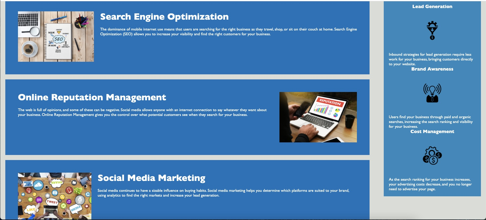
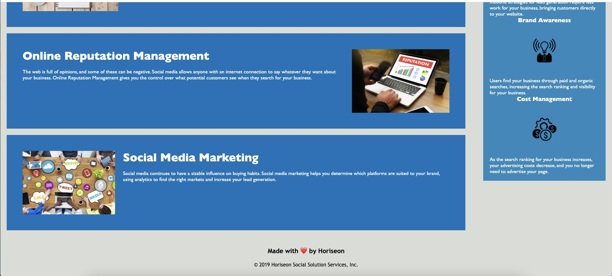

# Code refactor
## Description

The goal of the following project was to make the site more web accessible.
Implementing a codebase that follows accessibility standards, so the site is optimized for search engines.

- The source code has semantic HTML elements.
- The structure of the HTML elements follows a logical structure.
- The image elements have alt attributes defined.
- The heading attributes have sequential order.
- The title element is concise and descriptive.

All links are functioning correctly now.

There is a semantic structure of the HTML elements.

Comments are included before each element or section of the page.

The efficiency of the CSS by consolidating the selectors and properties.

## Screenshots of the website refactor

## Credits
I used W3Schools for some information regarding semantics.

